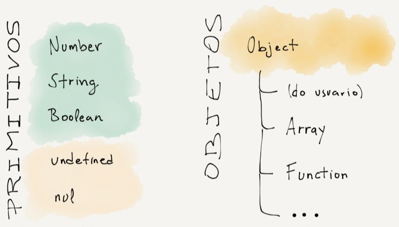

class: center, middle
# Tipos de Dados em JavaScript
### ©2017 Dalton Serey, Programação 3, UFCG
.center[]

---
class: center, middle

# Algorithms + Data Structures = Programs

Niklaus Wirth, 1976
---
# tipos de dados e sistema de tipos

- TD = conjunto de valores + conjunto de operações

   - valores que podem ser substituídos uns por outros


###  sistema de tipos _(type system)_

- conjunto de regras para associar tipos a valores

   - sistema formal para evitar estados indesejáveis em programas

   - anotações de tipo são fórmulas; programas são provas

- quando o programa não atende às restrições do sistema de tipos

   - o programa não compila (verificação estática)

   - o programa dá runtime error (verificação dinâmica)

---
# o TS de JS é para **não programadores**

- em Java, Python, etc

   - operações com operandos de tipos não suportados ⇒ .red[Erro]

- em JS a semântica tenta capturar “intenção”

   - os operandos sofrem _coerção_ pra de adequar à operação

   - além disso, as operações minimizam casos de erro

- coerções em JavaScript são ao mesmo tempo

   - uma poderosa _feature_ que facilita a codificação

   - e uma das maiores causas de frustração

---
# dois “tipos de tipos”: primitivos e objetos


<small>ES6 inclui ainda _Symbol_ (tipo primitivo)</small>
???
**primitivos**: imutáveis, equivalentes Object, autoboxing

**objetos**: base pra construção de estruturas de dados

---
# number

- **único tipo numérico** (ponto flutuante, 64 bits, IEEE 754)

- literais convencionais

   - decimais: `1`, `250`, `123.45`, `2.05`
   - notação científica: `1.23e-21`, `1.2e+55`
   - binários: `0b10011`, `0b10`
   - octais: `015`, `026` ou `0o15`, `0o26`
   - hexadecimais: `0xff`, `0x15a4`

- valores especiais

   - `NaN` (“**N**ot **a** **N**umber”)
   - `+Infinity`, `-Infinity`
   - `-0`
   - `Number.EPSILON` (igual a 2<sup>-52</sup>; novo em ES6)

- acesso à API de Number via autoboxing (`toFixed()`, etc)

---
# string

- sequência imutável de caracteres (utf-16)

- literais com aspas simples e duplas: `'ok'` e `"ok"`

- literais com _backticks_ (&#96;...&#96;) para _multi-line_ e _template
  literals_

  ```javascript
  const texto = `primeira linha
  segunda linha
  terceira linha`;

  peso = 40.5;
  idade = 11;
  msg = `Idade = ${idade}, Peso = ${peso}`;
  ```

- caracteres de escape convencionais

  ```code
             \'         \"         \\         \n         \r         \t
  ```

- acesso à API de String (via autoboxing)

---
# boolean

- valores `true` e `false`

   - este é um dos grandes problemas com coerção

- valores _falsy_ e _truthy_ — enorme fonte de problemas 👀

   - _falsy_: `false`, `null`, `undefined`, `+0`, `-0`, `NaN` e `""` 😠

   - _truthy_: qualquer valor que não seja _falsy_

- atentar pra (excelente) semântica de `||` e `&&`

   - ao estilo de python e bash, não de Java, C ou C++ ou C

   - melhor compreendidos como *seletores*

      - `&&` pode ser usado como uma guarda
      - `||` pode ser pensado como seletor de default

---
# null e undefined

- JS tem dois “_não valores_”: `null` e `undefined`

- cada um pertence a seu próprio tipo e é seu único valor

   - detalhe: `null` é palavra reservada, mas `undefined` não!

- não confundir `undefined` com _undeclared_!

- referenciar variável inexistente/não declarada é Erro! `ReferenceError` 

???

O problema aqui é que a mensagem de JS é `x is not defined` e dá
a impressão de que é o mesmo que dizer que x é undefined...  mas
não é! o ideal seria que fosse `x is not declared` ou algo do
tipo... menos confusão => melhor compreensão.

Ainda pode piorar. Use `typeof x` no caso acima; o resultado será
`undefined`, mesmo que x esteja não declarada!!! isso só aumenta
a confusão; veja que se você declarar uma variável e não a
atribuir, aí sim, o resultado é `undefined` corretamente. :-(

Contudo, `typeof x` funcionar mesmo com `x` não declarado é
desejável e útil; principalmente, em um ambiente em que vários
scripts compartilham um escopo global; isso muda um pouco de
figura com ES6... e módulos.

---
# operador `typeof`

- é um operador da linguagem

- produz uma string indicando o “_tipo_” do operando

- valores produzidos:

   - `'number'`
   - `'string'`
   - `'boolean'`
   - `'undefined'`
   - `'object'`
   - <span style="color: red;"><strike>`'null'`</strike></span>
   - `'undefined'`
   - <span style="color: blue;">`'function'`</span>

- atenção: tem **alta precedência**, o que pode causar confusão
---
### exemplos: typeof
```javascript
typeof 'a'      // 'string'
typeof 2        // 'number'
typeof 2 + 2    // 'number2' (!!)
typeof (2 + 2)  // 'number'
typeof 2 == 2   // 'false' (?!)
typeof (2 == 2) // 'boolean'
```

--
count: false
```javascript
typeof (true && false) // 'boolean'
typeof (true && false && 5) // 'boolean'
typeof (true && 5 && false) // 'number'
typeof 2 && 2   // 2 (?!)
typeof (2 && 2) // 'number'
```

--
count: false
```javascript
typeof null // 'object'
typeof { a: 10 } // 'object'
typeof new Number(231) // 'object'
typeof Number(231) // 'number'
typeof [1, 2, 3] // 'number'
```
--
count: false
```javascript
typeof dobro = x => x * 2 // 'function'
const triplo = function (x) { return 3 * x; }
typeof triplo // 'function'
```

---
class: center, middle
# Tipos de Dados em JavaScript

## Parte 2: Objetos

---
# object

- em JS, qualquer valor não primitivo é um objeto (**`object`**)

- objetos JS são **coleções de propriedades**

- cada propriedade é um par &langle;_nome_, _valor_&rangle;

   - _nomes_ são primitivos `string`

   - e _valores_ são qualquer valor, incluindo objetos

--
count: false
- diferente de outras LPs, JS tem **literais para objetos** 👍👍👍

- uma _feature_ importante:  **herança prototipal**

   - todo objeto “_herda_” propriedades de outro (seu protótipo)

   - acho melhor interpretar _herança_ em JS como _delegação_

   - mas, veremos isso mais adiante no curso...

---
### exemplos: literais de objetos

```javascript
const data = {
    dia: 31,
    mes: "agosto",
    ano: 1919
}
```

--
count: false
```javascript
const jackson = {
    nome: 'josé gomes filho',
    nascimento: {
        dia: 31,
        mes: "agosto",
        ano: 1919
    }
}
```

--
count: false
```javascript
const abp = {
    valor: 45
    esq: { valor: 16 },
    dir: {
        valor: 67,
        esq: { valor: 51 }
        dir: { valor: 70 }
    }
}
```

---
# objetos nativos ou _built-in_

### primitivos X objetos

- pra cada tipo primitivo, um objeto associado

   - `number` ⇔  `Number`
   - `string` ⇔  `String`
   - `boolean` ⇔  `Boolean`

- os objetos acima podem ser usados como:

   - funções de casting
   - _construtores_ via operador `new` (evite!)
   - _construtores_ via autoboxing (ok, você não precisa fazer nada)

---
### exemplos: primitivos X objetos

```javascript
const a = String('exemplo');    // primitivo string
const b = new String('exemplo') // objeto String (evite!)
a.length  // 7
b.length  // 7
typeof a  // 'string'
typeof b  // 'object'
```

--
count: false
```javascript
const a = Number('451');    // primitivo number
const b = new Number(451);  // objeto Number (evite!)
a.toFixed(2);  // '451.00'
b.toFixed(2);  // '451.00'
typeof a;      // 'number'
typeof b;      // 'object'
```

--
count: false
```javascript
"exemplo".length;   // 7
451.toFixed(2)    // SyntaxError (!)
451..toFixed(2)   // '451.00' (!!)
```

---
# objetos nativos ou _built-in_

### dois objetos especiais: Array e Function

- **`Array`**: objeto que “simula” arrays e listas

- **`Function`**: objeto especial que pode ser “executado”

--
count: false

São tão importantes que têm léxico, sintaxe e semântica
próprias...

---
# Arrays

```javascript
// objeto Array via literal (ok)
const a = [];  // array vazio
const b = [1, 2, 3];  // [ 1, 2, 3 ]
a.length // 0
b.length // 3

a.push(4) // a passa a ser [ 1, 2, 3, 4 ]
a.pop() // 4
a // [ 1, 2, 3 ]
a.join('') // '123'

```
--
count: false
```javascript
// objeto Array via construtor (não use!)
// obs: com ou sem new dá no mesmo
const b = new Array(1, 2, 3) // [ 1, 2, 3 ]
const d = Array(1, 2, 3)  // [ 1, 2, 3 ]
const c = new Array(3)  // [ <3 empty items> ]
const e = Array(3)  // [ <3 empty items> ]

e[1] = 10;
console.log(e)    // [empty × 1, 10, empty × 1] (!)
console.log(e[0]) // undefined (!)
```

Use `Array.from()` pra produzir Arrays a partir de objetos (ES6).

---
# Functions 👏👏👏

- o melhor construto de JavaScript

- functions JS são _first-class_ 'objects' ⇒

   - são valores como outros quaisquer da linguagem
   - podem ser ligados a variáveis
   - podem ser ligados a parâmetros
   - podem ser o resultado de uma expressão 
   - podem ser o valor calculado/retornado por funções (!)

- e, obviamente, são executáveis

--
count: false
- functions JS são mais fortemente inspiradas na matemática

   - base para suportar programação no estilo funcional

   - mas, veremos isto mais adiante no curso

---
### exemplos: functions

```javascript
// sintaxe baseada em new (Não use!!!)
const f = new Function('x', "{ return x * 2; }");
const g = new Function('x', "{ return x + 1; }");

// invocação de funções
f(10)   // 20
g(10)   // 11
f(g(3)) // 8
g(f(3)) // 7
```

--
count: false
```javascript
// definições de funções (sintaxe "arrow" de ES6)
const f =    x => x * 2;
const g =    x => x + 1;
```

--
count: false
```javascript
// sintaxe completa
const f = function(x) {
    return x * 2;
}
const g = function(x) {
    return x + 1;
}
```

---
### exemplo: objetos com arrays e functions

```javascript
const jackson = {
   nome: 'josé gomes filho',
   nascimento: {
      dia: 31,
      mes: "agosto",
      ano: 1919
   },
   instrumentos: ['pandeiro', 'bateria', 'voz'],
   prim_nome: function () {
      return this.nome.split(' ')[0];
   }
}
```

Atente também, para os literais de _Array_ e _Function_.

--
count: false
**Quem precisa de classes e de `new` com literais pra
objetos?!**

---
# leituras indicadas
- Capítulo 3 do Definitive Guide, 6th edition
- Capítulos 1 e 2 do You Don't Know JavaScript, Types and Grammar
- Seção 4.7 do Definitive Guide, 6th edition
- [Operator precedence](https://developer.mozilla.org/en-US/docs/Web/JavaScript/Reference/Operators/Operator_Precedence)
- [JavaScript String Methods](https://www.w3schools.com/js/js_string_methods.asp)
- [Number Methods](https://www.w3schools.com/js/js_number_methods.asp)
