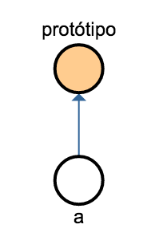
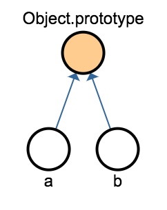
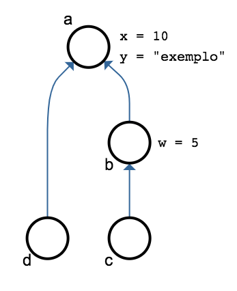
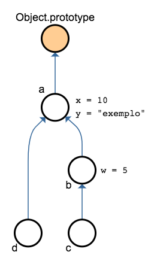
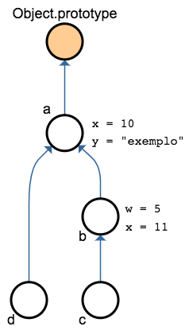

class: center, middle
# Prototypes
### ©2017 Dalton Serey, Programação 3, UFCG
.center[]
---
# todo objeto JS tem um protótipo

.left-column[
o que é e pra que serve um protótipo?

- é um objeto ao qual o primeiro objeto está ligado

- um protótipo serve de “apoio” ou “complemento”

- um objeto delega ao protótipo o que não pode “resolver”

   - property não encontrada ⇒  busca no protótipo

]
.right-column[]

---
# Object.prototype

JavaScript provê um protótipo de uso geral, na função Object.red[<sup>∗</sup>]
```javascript
Object.prototype
```
- é o protótipo _default_ para os objetos criados por literais
- bem como para os objetos criados com `new Object()`

.footnote[.red[∗] `Object` é uma função nativa, tal como `String`, `Number`, etc]
--
count: false
.left-column-70[
podemos confirmar isso com `Object.getPrototypeOf()`
```javascript
const a = {};
Object.getPrototypeOf(a) === Object.prototype; // true

const b = new Object();
Object.getPrototypeOf(b) === Object.prototype; // true
```
]
.right-column-30[

]

---
# property \_\_proto\_\_

protótipos também podem ser acessados pela property `__proto__`
```javascript
const a = {};
a.__proto__ === Object.getPrototypeOf(a); // true
a.__proto__ === Object.prototype;  // true
```

- a property `__proto__` só foi padronizada em ES6

- ainda assim, prefira o uso de `Object.getPrototypeOf()`

---
# cadeia de protótipos
.left-column-50[]
.right-column-50[
protótipos podem ter protótipos

logo, há uma _cadeia de protótipos_
```javascript
const a = {x: 10, y = "exemplo"};
const b = {w: 5};
const c = {}, d = {};

b.__proto__ = a;
c.__proto__ = b;
d.__proto__ = a;
```
logo
```javascript
b.x; // 10
c.x; // 10
d.x; // 10
c.w; // 5
d.w; // undefined```
]

---
# cadeia de protótipos completa

.left-column-40[]

.right-column-60[
`Object.prototype` é a raiz da cadeia

```javascript
Object.prototype.__proto__; // null
```

a resolução de uma property para na raiz

```javascript
d.z; // undefined
c.k; // undefined
```
]

---
# herança prototipal (ou delegação)

é o nome dado à resolução de properties baseada em protótipos 

se a property não existe no objeto, é buscada em seu protótipo

```javascript
const a = {x: 10, y = "exemplo"};
const b = {};
```
--
count: false
se fizermos `a` ser o protótipo de `b`...
```javascript
b.__proto__ = a;
```
--
count: false
... as properties de `a` passam a estar disponíveis em `b`
```javascript
b.x; // 10
b.y; // "exemplo"
b.z; // undefined
b;   // {}
```

---
# _property shadowing_

- a cadeia de protótipos é usada **exclusivamente para leituras**

- escrita de properties é feita sempre no objeto referenciado

- atribuições podem mudar properties lidas do protótipo, mas...

   - isso cria novas properties no objeto referenciado
   - e oculta a property de mesmo nome no protótipo
   - ⇒  o valor original usado por outros objetos fica protegido

---
# exemplo
considere os objetos `a`, `b` e `c` como definidos antes
```javascript
const a = {x: 10, y = "exemplo"};
const b = {}, c = {}, d = {};
b.__proto__ = a;
c.__proto__ = b;
d.__proto__ = d;
b.x;           // 10 (b não tem x: valor vindo de a)
c.x;           // 10 (c não tem x: valor vindo de a, via b)
d.x;           // 10 (d não tem x: valor vindo de a)
```

--
count: false
embora `b.x` não esteja definido em `b`, façamos uma atribuição
```javascript
b.x = b.x + 1; // 11 (cria property x em b = valor vindo de a + 1)
```

--
count: false
isso cria a property `x` em `b`, sem afetar nem `a` e `d`, mas afeta `c`
```javascript
b.x; // 11 (b tem x)
d.x; // 10 (d não tem x: valor vindo de a)
c.x; // 11 (c não tem x: valor vindo de b)
```

---
# exemplo
agora, `c` e `b` não “vêem” mais a property `x` de `a`
<div style="display: flex; flex-flow: row wrap; justify-content:
space-around; align-items: center">
  </img>
  $⇒$ &nbsp;
  </img>
</div>

---
# como identificar properties próprias?

### getOwnPropertyNames()

- a função `getOwnPropertyNames()` tem esse propósito

    - é acessível através da função nativa `Object`
    - toma um objeto como parâmetro<sup style="color: red;">∗</sup>
    - retorna array com os nomes das properties próprias de um objeto

.footnote[.red[∗] Experimente ver o que ocorre se for usado um primitivo]

--
count: false
```javascript
const a = {x: 10, y: "abc"}, b = {};
b.__proto__ = a;

a.x; // 10
b.x; // 10

Object.getOwnPropertyNames(a); // ["x", "y"]
Object.getOwnPropertyNames(b); // []
```

---
# como identificar properties próprias?
### hasOwnProperty()

- outra alternativa é a função `hasOwnProperty()`

    - observe que é um _método_ (usa a notação OO)
    - recebe uma string como parâmetro
    - e retorna um boolean

--
count: false
```javascript
const a = {x: 10, y: "abc"}, b = {};
b.__proto__ = a;

a.x; // 10
b.x; // 10

a.hasOwnProperty('x'); // true
a.hasOwnProperty('x'); // false
```

---
# Array.prototype

- relembre que arrays são simples objetos em JS
- e que todos os seus _métodos_ vêm de um mesmo protótipo
   - o protótipo de todo array é o objeto `Array.prototype`
   - já vimos algumas das properties: `map`, `filter`, `find`, `reduce`, etc…

--
count: false
considere os seguintes arrays
```javascript
const v1 = [11, 60, -21, 45];
const v2 = ['a', 'b', 'c'];
```

--
count: false
verifique que ambos têm o mesmo protótipo: `Array.prototype`…
```javascript
v1.__proto__ === Array.prototype; // true
v2.__proto__ === Array.prototype; // true
```

--
count: false
…e que a ele “pertencem” os chamados _métodos_
```javascript
v1.hasOwnProperty('map'); // false
Array.prototype.hasOwnProperty('map'); // true
```

---
# exercício

qual o valor da última expressão no código abaixo?  explique.

```javascript
const v = [1, 2, 3];
Object.getOwnPropertyNames(v);
```

---
# Function.prototype

- funções também são objetos plenos em JS

- logo, embora possa parecer estranho, funções…

   - podem ter suas próprias _properties_
   - e têm seu próprio protótipo: `Function.prototype`

```javascript
const dobro = x => 2 * x;
dobro.__proto__ === Function.prototype; // true
```

mais adiante, voltaremos ao assunto funções X protótipos

---
# protótipos: herança X delegação

- o processo **não envolve cópias de dados** de um objeto para outro

   - os dados não ficam no objeto: são acessados no protótipo
   - a cada acesso, o engine percorre a cadeia de protótipos

- a relação entre objeto e protótipo é circunstancial

   - não implica em relação de tipo / subtipo
   - e pode ser alterada por shadowing 👍 (ou mudança de protótipo 👎)

--
count: false
- por isso, a relação é melhor entendida como _delegação_…

--
count: false
   - de natureza dinâmica
   - ajustável em tempo de execução
   - que não envolve _classes_ ou outras entidades especiais
   - só ligações entre objetos simples

---
# lições importantes

- _herança prototipal_ é uma forma simples e eficiente de
  reutilizar properties de um objeto em outros; não requer nenhum
  objeto especial (_classes_, _construtores_ ou coisas do tipo);
  apenas ligações entre objetos (a cadeia de protótipos) e uma
  regra de uso da cadeia;

- a cadeia de protótipos só é usada para leitura de objetos;
  nunca para escrita; logo, escritas são sempre realizadas no
  objeto diretamente referenciado na expressão;
  
- ao escrever uma property disponível na cadeia de protótipos,
  esconde-se a property da cadeia; para efeitos do objeto em si,
  isso equivale a “mudar” o valor da property; para o protótipo,
  contudo, e para os demais “herdeiros” do protótipo, isso não
  tem efeito algum;

- combinada ao fato de que funções são objetos de primeira ordem,
  a herança prototipal é a forma natural pela qual objetos JS
  compartilham funcionalidades; tipicamente, funções são
  colocadas em protótipos de forma que podem ser “reutilizadas”
  pelos demais objetos como se fossem deles;
